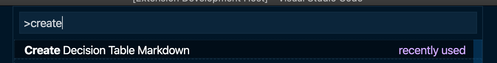
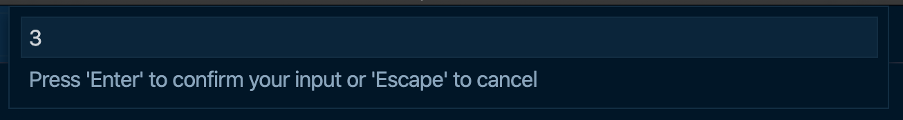
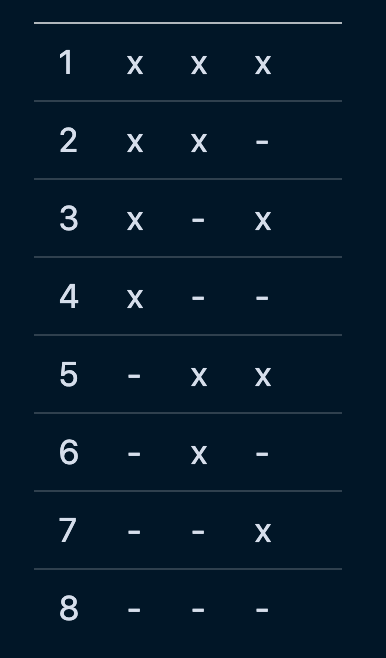

# decision-table-markdown-generator

Generate Markdown for Decision Tables as described in "[Decision Tables](https://www.hillelwayne.com/post/decision-tables/)".

## Features

To create a decision Table, open or create a new Markdown file and select "Create Decision Table Markdown":

Next, insert the amount of conditions you want your table to have:

The table will be inserted at the current cursor position. If you enable the Markdown preview, it'll look like this:

## Requirements

## Extension Settings

## Known Issues

## Release Notes

### 0.0.1

Add Feature: Create Table from User Input

-----------------------------------------------------------------------------------------------------------

**Enjoy!**
